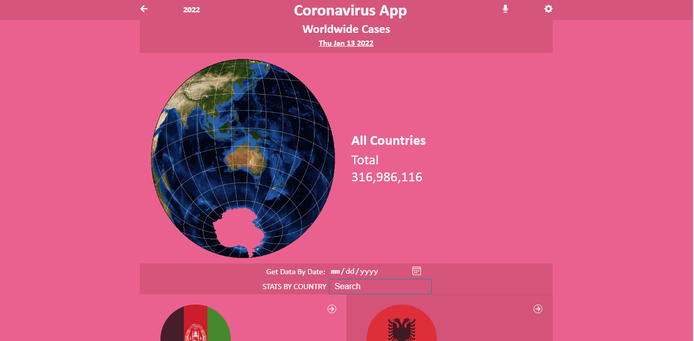
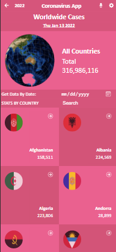

# Covid-19 Information App

This React capstone project is about building a mobile web application to check a list of metrics (numeric values) that you will create making use of React and Redux.

I chose the Covid-19 API to show the information currently affect a lot of people in the world. It displays information based on a country and users can search for a particular country as well as filter the dates to view information for a particular day.

# Biult with:
1. HTML
2. CSS
3. JavaScript
4. React
5. Redux

# Online Demo Link
[View App Online](https://lichapa-covid19info.netlify.app/)
# App Intro Video
[View App Intro](https://www.loom.com/share/b6d730474fdf4f9db7a6d98c8229ffc0)

# App Screenshot (Desktop)

# App Screenshot (mobile)

## Getting Started

- Click on the `Code` green drop down button then COPY.
- In your local PC, open your terminal in the folder you would like to clone the repository into
- Clone the repository with the command: `git clone (copied link)`; like so: `git@github.com:Lichapa/react-capstone.git`
- After the clone, type in the command `cd react-capstone` to access the app directory on the terminal
- Run `npm install` to get all the project dependancies.
- Run `npm run start` to start the dev-server.

## Tests
- Run `npm test`.

## Author

👤 **Mphatso Lichapa**
- GitHub: [@Lichapa](https://github.com/Lichapa)
- Twitter: [@LichapaMphatso](https://twitter.com/LichapaMphatso)
- LinkedIn: [mphatsolichapa](https://www.linkedin.com/in/mphatsolichapa)

## Contributing

Contributions, issues, and feature requests are welcome!
Feel free to contribute

Feel free to check the [issues page](https://github.com/Lichapa/react-capstone/issues/).

## Show your support

Give a ⭐️ if you like this project!

## Acknowledgments
- A special thanks to Nelson Sakwa, the creator of the original design layout.
- Facebook team that developed create-react-app and React Redux as open source.
- Microverse for inspiring this project.
## 📝 License

This project is [MIT](./LICENSE) licensed.
